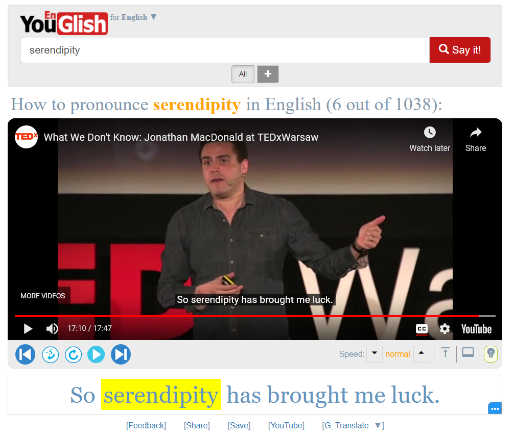

# Aglish

Read in: [العربية](README.ar.md)

--------

[Anki](https://apps.ankiweb.net/) add-on for [YouGlish](https://youglish.com/); a service that helps you learn
a language in context by showing you Youtube videos containing a word or a phrase you want
to learn its pronunciation, meaning, etc.

YouGlish supports many languages and customizations of the interface. This add-on supports all languages supported by YouGlish and some customizations.

## Usage

The add-on integrates YouGlish with Anki through a custom filter you put in your card templates (e.g. `{{aglish:Front}}`).

Its usage is quite simple. Let's go through some examples:

- `{{aglish lang=english accent=uk:Front}}`  
  This will show you video usage examples of the text in your Front field in British English.
- The video widget will be hidden behind a button by default.
  You can change the text shown on the button via the `label` option (no spaces allowed for now):  
  `{{aglish lang=english accent=uk label=youglish_english_uk:Front}}`
- Alternatively, You can make the video play automatically by using the `autoplay` option:  
  `{{aglish lang=english accent=uk autoplay:Front}}`  
  Bear in mind that if you review a lot of cards quickly with autoplay enabled, you may get temporarily blocked or
  asked to solve a captcha. It's recommended to enable autoplay only when the main focus of your note type is the YouGlish videos,
  so that you won't go to the next card before watching a clip, or you will be just answering cards without thinking.
- You can combine Anki's `cloze-only` filter with the `aglish` filter to query only elided sections in cloze note types:  
  `{{aglish lang=english:cloze-only:Text}}`
- The `cloze-only` filter only works on the back side, so this add-on provides a similar option (`clozeonly`) that works on both sides as a bonus:  
  `{{aglish lang=english clozeonly:Text}}`
- The `nocaps` option is useful here to hide captions when watching clips containing elided text in the front side:  
`{{aglish lang=english clozeonly nocaps:Text}}`
- You can also change the widget theme using the `theme` option:  
`{{aglish theme=dark:Text}}`  
  Available values are `light`, `dark`, and `anki` (theme used in Anki's interface, the default).
- The width and height of the widget can be customized using the `width` and `height` options:  
`{{aglish lang=arabic width=600 height=500:Front}}`  
  The widget will expand to the window size if these options are not specified.

All options have default values so they can be omitted; `{{aglish:Front}}` assumes English in all accents, showing a widget in Anki's theme with captions.

For a list of all supported languages and accents, see [YouGlish documentation](https://youglish.com/api/doc/js-api) (scroll down to the documentation of the `widget.fetch` function).

Watch [this video](https://www.youtube.com/watch?v=aqc98e5ar64) for a demo of the add-on.

## Experimental Support for YouGlish login

I've recently added experimental support to allow users to use their YouGlish account and premium subscription plans in the add-on. This is not tested. I appreciate if someone can test it with their premium plan and tell me about the result.

To use your YouGlish account with the add-on, you first need to log in to your YouGlish account in your
web browser, then copy some cookie values and paste them in the [add-on's config](https://docs.ankiweb.net/addons.html) under the `cookies` property.
You can see the cookies by opening the developer tools of your browser and going to the Storage tab,
then you will find a list of values under **Cookies > https://youglish.com**. You need to copy at least
the values of the cookies with the following names: `__stripe_mid`, `yg_username`, `yg_session`, and `JSESSIONID`.
See https://cookie-script.com/documentation/how-to-check-cookies-on-chrome-and-firefox for more detailed instructions.
You may need to change these values periodically, and you'll need to change them if you log out of your YouGlish account in the browser.

## References

YouGlish widget API:
 - https://youglish.com/api/doc/widget
 - https://youglish.com/api/doc/js-api

